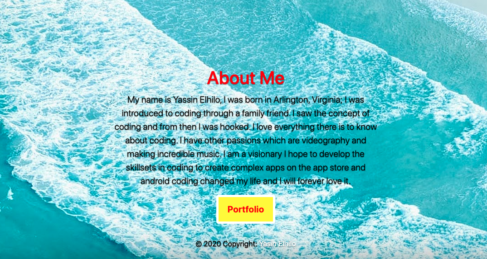

# HomeWorkTwo

## Description

```
This is a website that I designed that has three pages, It was made specifically to implement these programming languages that we learned in the coding bootcamp. Html for information css to make a responsive website and style. I created 5 stylesheets and 3 html files 1 stylesheet was to target the (index.html) and  the other stylesheet was from bootstrap website (bootstrap.min.css) and the rest of the stylesheets were assinged to one of the html files. Each stylesheet has the name of the html file that we are trying to style.  

```

## Programming Languages 
```
Html 
Css
```

## Note
```
I was faced with multiple difficulties mainly due to the fact that the bootcamp didn't educate us in depth about css grid or flexbox, media queries. The bootstrap css framework already comes with components that come with classes so if you don't like possibly the look or UI of that specific component; then you would have to modify it by adding something to the preset class class="bootstrap" example: class="boostrapyaze" so by adding something to the preset class it removes the component from all preset css styling that bootstrap added to that component. Thats when you use your coding knowledge to make that component adhere to the things you want to do like the look the coloring etc. Not knowing css grid or flexbox, media queries makes it difficiutl to modify the components to how you want it ass far as layout.
```


## Website Url
```
 https://elhiloyasin.github.io/HomeWorkTwo/
```


## Images of Website 
'''
;
;
;
'''
